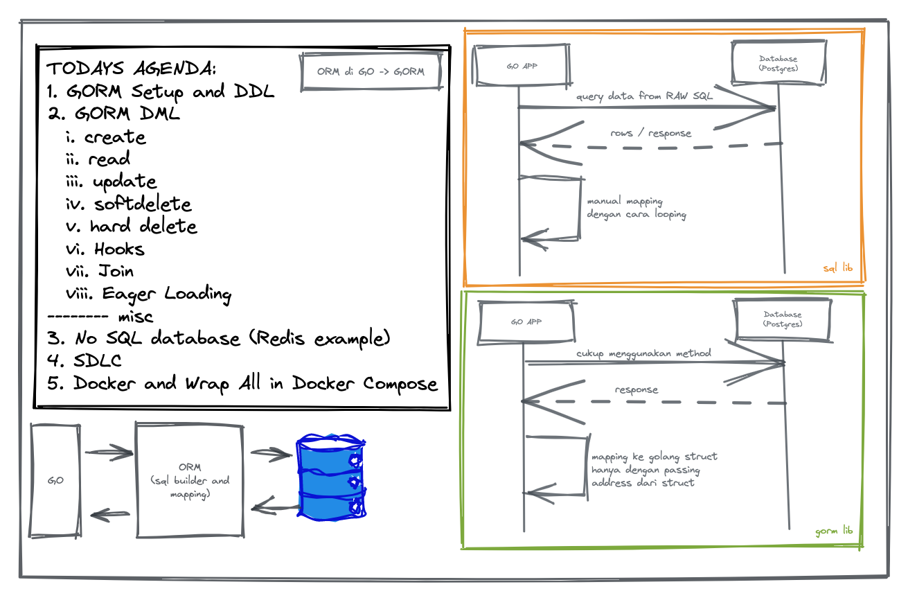

# DTS BATCH 7

1. GORM Setup and DDL
2. GORM DML
  i. create
  ii. read
  iii. update
  iv. softdelete
  v. hard delete
  vi. Hooks
  vii. Join
  viii. Eager Loading 
-------- misc
3. No SQL database (Redis example)
4. SDLC
5. Docker and Wrap All in Docker Compose



```
go get -u github.com/gin-gonic/gin
go get -u github.com/lib/pq

-- GORM
go get -u gorm.io/gorm
go get -u gorm.io/driver/postgres

-- setup
go mod tidy
```