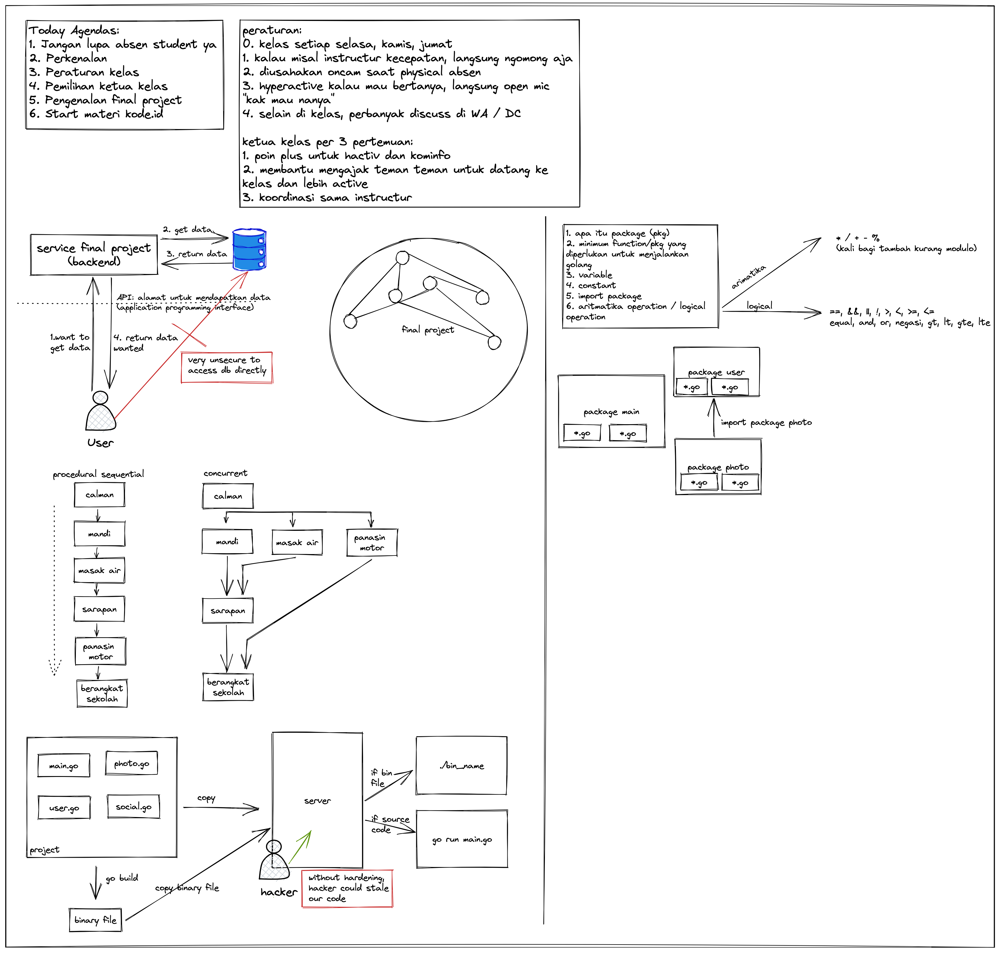

# DTS Day 1

## Table of Contents

- [About](#about)
- [Getting Started](#getting_started)
- [Usage](#usage)
- [Contributing](../CONTRIBUTING.md)

## About 

This project is day 1 project of DTS kominfo, and the context is:
1. apa itu package (pkg)
2. minimum function/pkg yang diperlukan untuk menjalankan golang
3. variable
4. constant
5. import package
6. aritmatika operation / logical operation

 
