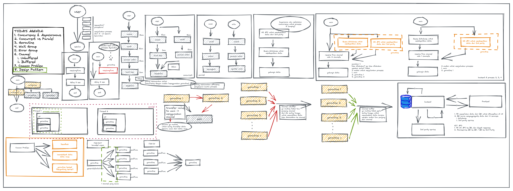

# DTS BATCH 7

TODAYS AGENDA:
1. Concurrency & Asynchronous
2. Concurrent vs Paralel
3. Goroutine
4. Wait Group
5. Error Group
6. Channel
  i. Unbuffered
  ii. Buffered
7. Common Problem 
8. Design Pattern

