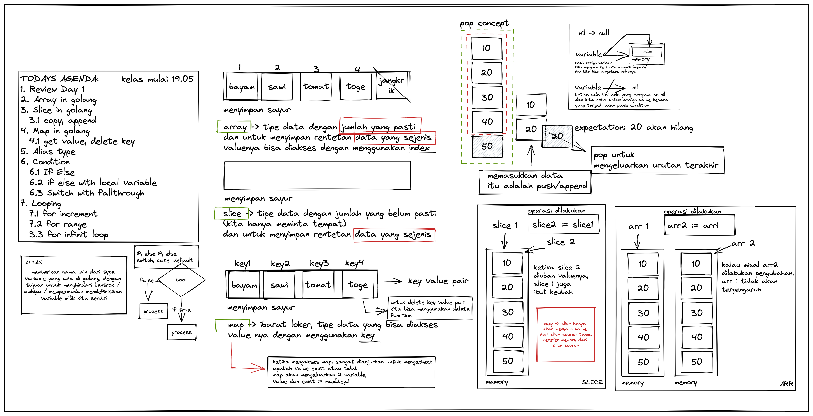

# DTS BATCH 7

TODAYS AGENDA:
1. Review Day 1
2. Array in golang
3. Slice in golang
- copy, append
4. Map in golang
- get value, delete key
5. Alias type
6. Condition
- If Else
- if else with local variable
- Switch with fallthrough
7. Looping
- for increment
- for range
- for infinit loop
 
    