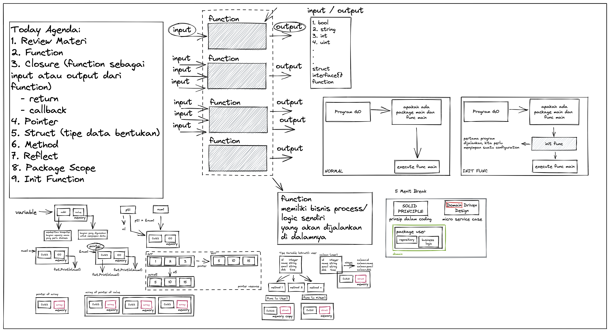

# DTS BATCH 7

1. Review Materi
2. Function 
3. Closure (function sebagai input atau output dari function)
  - return
  - callback
4. Pointer
5. Struct (tipe data bentukan)
6. Method
7. Reflect
8. Package Scope
9. Init Function
